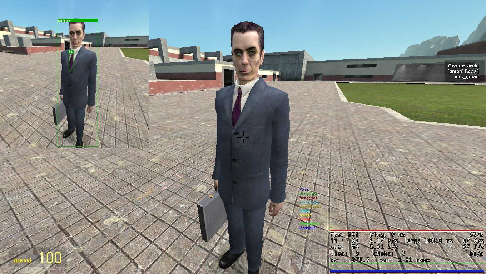
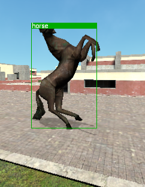
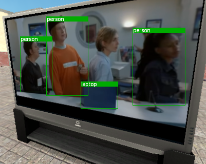
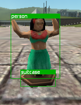
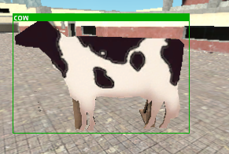
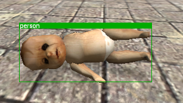
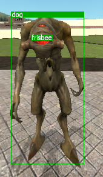

# gm_YOLOX
Object detection for Garry's Mod! Train your own YOLOX variant, or use an existing one, and run it real-time inside the game. Works on Windows, but can be altered to work on other platforms that have a working ONNX Runtime, on Windows it uses DML as the execution provider, but could use CUDA for example under Linux AND Windows (fuck you NVIDIA, working with your developer *tools* is a nightmare).
This module was meant only for YOLOX models, hence the very original name.

## Features
- Multithreaded (sort of)
- Supports both 32 & 64 bit branch (currently Windows only)
- Accepts RenderTargets from Lua as the input (uses Source Engine's Queued Material System)
- Has NMS & Probability sorting included
- Uses STB Image Resize2 for scaling the input, no OpenCV needed, thus the size of the DLL is very small

## Some screens from the example








## How to install
### Windows 64bit branch (chromium)
- Download the latest release ZIP for Win64
- Move/Copy `gmcl_yolox_win64.dll` inside `<GARRYSMOD ROOT>/garrysmod/lua/bin`
- Move/Copy `DirectML.dll` inside `<GARRYSMOD ROOT>/bin/win64`
- Move/Copy `onnxruntime.dll` inside `<GARRYSMOD ROOT>/bin/win64`
### Windows 32bit branch (stock)
- Download the latest release ZIP for Win32
- Move/Copy `gmcl_yolox_win32.dll` inside `<GARRYSMOD ROOT>/garrysmod/lua/bin`
- Move/Copy `DirectML.dll` inside `<GARRYSMOD ROOT>`
- Move/Copy `onnxruntime.dll` inside `<GARRYSMOD ROOT>`

## How to compile
### Windows
- Use the included Visual Studio 2022 solution, everything is preconfigured, just hit Build
- On Windows, the ONNX & DirectML are included through a NuGet package!

## Small documentation
```
YOLOX.Initialize(modelPath : string, modelInputWidth : number, modelInputHeight : number)
```
- **modelPath** - path to the YOLOX model, relative to `<GARRYSMOD ROOT>`
- **modelInputWidth** - input tensor width
- **modelInputHeight** - input tensor height

```
YOLOX.SetMean(mean : vararg)
```
- **mean** - mean for normalization, use this only when your model requires it, for each channel add one argument

```
YOLOX.SetNormal(normal : vararg)
```
- **normal** - normal for normalization, use this only when your model requires it, for each channel add one argument

```
YOLOX.SetNMSThreshold(nms : number)
```
- **nms** - threshold for NMS (0 - 1), default is 0.75

```
YOLOX.SetProbabilityThreshold(prob : number)
```
- **prob** - threshold for probability of detection (0 - 1), default is 0.5

```
YOLOX.CreateSession()
```
- commits all configurations made so far (look above) and creates a session
- returns true if successful

```
YOLOX.AddRenderTarget(rt : ITexture)
```
- **rt** - input RenderTarget
- queues up a RenderTarget to be processed

```
YOLOX.SetScaleOverride(enabled : bool, overrideWidth : number, overrideHeight : number)
```
- **enabled** - toggle override
- **overrideWidth** - width
- **overrideHeight** - height

```
YOLOX.GetObjects()
```
- returns a table with all last detections made, or an empty table
- each detected object has these fields:
    - **label** - the label ID
    - **prob** - probability (0 - 1)
    - **x** - x position (relative to the input RenderTarget OR to the overriden scale)
    - **y** - y position (relative to the input RenderTarget OR to the overriden scale)
    - **w** - rectangle width
    - **h** - rectangle height

## Example code
- This example code creates a RenderTarget into which we draw the current scene at a specified FrameRate
- The detections are then shown on top of the RenderTarget with their labels (Coco dataset)
```lua
local rtWidth = 416
local rtHeight = 416
local nextSnap = 0
local snapFPS = 10

require("yolox")
YOLOX.Initialize("yolox_tiny.onnx", 416, 416)
YOLOX.SetMean(0.485, 0.456, 0.406)
YOLOX.SetNormal(0.229, 0.224, 0.225)
YOLOX.SetNMSThreshold(0.5)
YOLOX.SetProbabilityThreshold(0.6)
YOLOX.CreateSession()

local rtTexture = GetRenderTargetEx("somename",
    rtWidth, rtHeight,
	RT_SIZE_NO_CHANGE,
	MATERIAL_RT_DEPTH_SEPARATE,
	bit.bor(2, 256),
	0,
	IMAGE_FORMAT_BGRA8888
)

local rtMaterial = CreateMaterial("rtmaterial", "UnlitGeneric",
{
	["$basetexture"] = rtTexture:GetName(),
	["$translucent"] = "0"
});

local yoloxLabels =
{
    "person",
    "bicycle",
    "car",
    "motorbike",
    "aeroplane",
    "bus",
    "train",
    "truck",
    "boat",
    "traffic light",
    "fire hydrant",
    "stop sign",
    "parking meter",
    "bench",
    "bird",
    "cat",
    "dog",
    "horse",
    "sheep",
    "cow",
    "elephant",
    "bear",
    "zebra",
    "giraffe",
    "backpack",
    "umbrella",
    "handbag",
    "tie",
    "suitcase",
    "frisbee",
    "skis",
    "snowboard",
    "sports ball",
    "kite",
    "baseball bat",
    "baseball glove",
    "skateboard",
    "surfboard",
    "tennis racket",
    "bottle",
    "wine glass",
    "cup",
    "fork",
    "knife",
    "spoon",
    "bowl",
    "banana",
    "apple",
    "sandwich",
    "orange",
    "broccoli",
    "carrot",
    "hot dog",
    "pizza",
    "donut",
    "cake",
    "chair",
    "sofa",
    "pottedplant",
    "bed",
    "diningtable",
    "toilet",
    "tvmonitor",
    "laptop",
    "mouse",
    "remote",
    "keyboard",
    "cell phone",
    "microwave",
    "oven",
    "toaster",
    "sink",
    "refrigerator",
    "book",
    "clock",
    "vase",
    "scissors",
    "teddy bear",
    "hair drier",
    "toothbrush"
}

hook.Add("HUDPaint", "capture_show", function()
	surface.SetDrawColor(255, 255, 255)
	surface.SetMaterial(rtMaterial)
	surface.DrawTexturedRect(0, 0, rtWidth, rtHeight)

    local objects = YOLOX.GetObjects()
    for i = 1, #objects do
        local object = objects[i]

        surface.SetDrawColor(0, 170, 0, 255)
        surface.DrawOutlinedRect(object.x, object.y, object.w, object.h, 1)

        surface.SetDrawColor(0, 170, 0, 255)
        surface.DrawRect(object.x, object.y, object.w, 10)

        draw.SimpleText(yoloxLabels[object.label + 1], "DermaDefault", object.x + 2, object.y - 2, color_white)
    end
end)

hook.Add("PostRender", "capture", function()
    local curTime = CurTime()

    if curTime > nextSnap then
        render.PushRenderTarget(rtTexture)
            render.Clear(0, 0, 0, 255)
            render.ClearDepth()

            cam.Start2D()
                render.RenderView({origin = EyePos(), angles = EyeAngles(), x = 0, y = 0, w = rtWidth, h = rtHeight, fov = 90})
            cam.End2D()
        render.PopRenderTarget()

        YOLOX.AddRenderTarget(rtTexture)
        nextSnap = curTime + (1 / snapFPS)
    end
end)
```
## Planned features
- BYTETrack as an optional addon
- Multiple instances